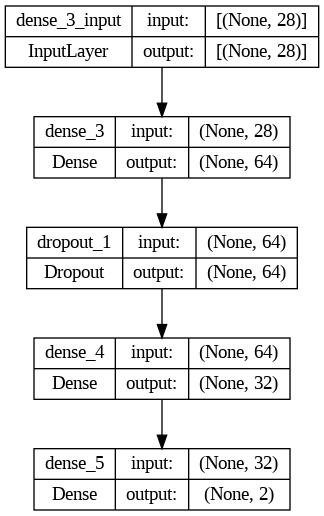

# sEMG based 3D printed Bionic-arm
sEMG based Bionic arm neural network model and its real life implementation

## System Flowchart
<local link to image file>
  
## Model Architecture

  
## 3D printed parts

  
  
  
  

    
## Final motion
  <local link to video file>
    
 
    
 
  
 

## Installation and Running of project
We will have to setup the UI and API separately. Also, separate arduino code for prosthetic arm motion. 
    
## Follow these three steps as below

### 1. API setup

We are using fast API. Follow these steps in terminal

- `cd API` 
- `pip install -r requirements.txt` 
- `uvicorn main:app --reload` 

You will get INFO:     Uvicorn running on http://127.0.0.1:8000 (Press CTRL+C to quit) after fastapi runs successfully

### 2. UI setup

We are using React JS for front end. Follow following steps in terminal

- `cd UI` 
- `cd bionicarm` 
- `npm install` 
- `npm start` 

Now you are good to go. You can go to http://localhost:3000 to see the UI

You can upload the csv file which are collected from 2 channel sEMG sensor and get the predicted result from the model. 
The model is trained on only 2 classes "paper" and "scissors". 

You will also see the "arm motion in progress" prompt. 

### 3. Arduino setup

Now we setup the code for arduino to make finger movements in 3D printed arm. 

Follow these steps to upload the code to arduino. 

- `cd arduino` 
- Select the port for your arduino board
- Upload file close_motion.ino

Make sure to change the port for arduino NANO or UNO board at line 54 of main.py file.
    
- `API-> main.py -> Line 54 -> ser = serial.Serial('/dev/cu.usbmodem101', 9600)  # replace '/dev/cu.usbmodem101' with the appropriate port name`

Initially the arm will be set at rest condition.

## Yep we have done it and we are ready to do see our arm moving. 

Now upload any one of the csv file from "test" folder of this repo and see the model prediction and at the same time we can now see our 
bionic arm performing the predicted motion either "paper" or "scissors".

### 4. Real time implementation (Optional)

If you have working 2 channel sensors you can try this in real time. 
If you want to implement this project at real time then follow following steps to modify the code :

- `cd API` 
- `uvicorn realtime:app --reload` 
- `axios.get('http://127.0.0.1:8000/') # file directory UI -> bionicarm -> src -> components -> Uploadfile.js -> line 35` 

